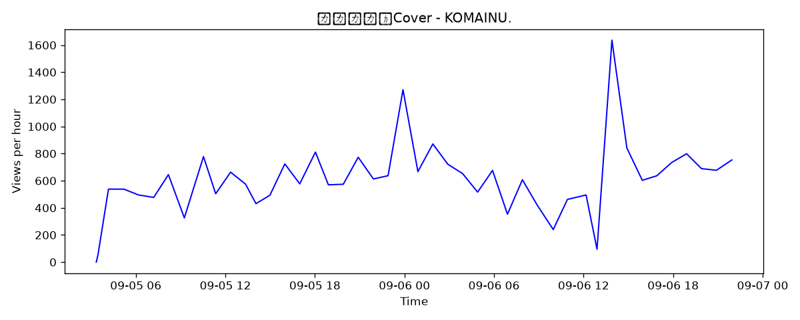
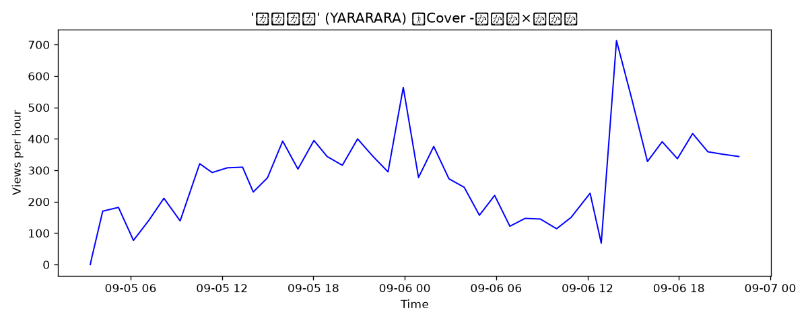
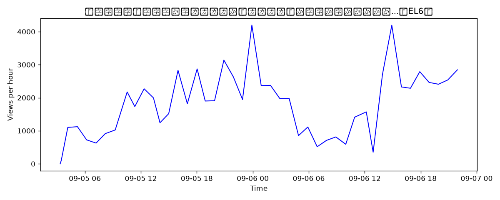

# 📊 自動分析レポート
生成時刻: **2026-09-06 13:21:17.951435**

## 🏆 成長速度ランキング

| videoId     |   total_growth |   avg_hourly |   max_spike |
|:------------|---------------:|-------------:|------------:|
| T24rF_x0TmQ |         611006 |    13282.7   |     2.39598 |
| xJQ6KrmdpD0 |          80954 |     1759.87  |     2.53187 |
| SnZvS3f5IrA |          27211 |      591.543 |     2.5407  |
| pRy8kStWlAw |          12330 |      268.043 |     2.49228 |

# 4版 波及モデル

スパイクなし → 波及なし

## 📈 時速グラフ（各版）

### ヤラララ／Cover - KOMAINU.

### [MV] ABM - 'ヤラララ' (YARARARA) feat. 重音テト
![[MV] ABM - 'ヤラララ' (YARARARA) feat. 重音テト](graph_T24rF_x0TmQ.png)

### 'ヤラララ' (YARARARA) ／Cover -しゆん×ばぁう

### 【以心伝心】新人歌い手グループが『ヤラララ』を本気で歌ってみたら...【EL6】

