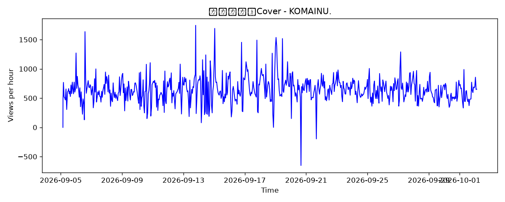
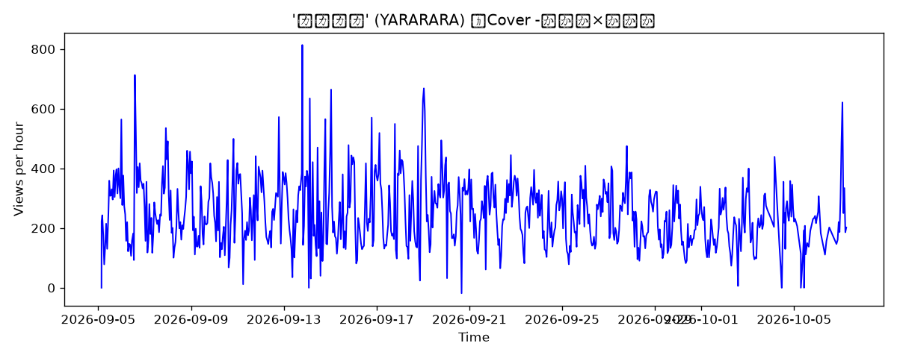
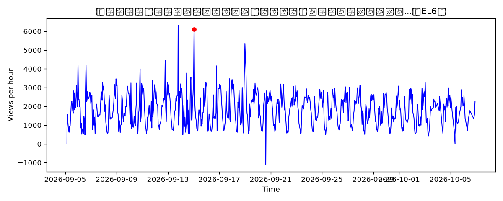

# 📊 自動分析レポート
生成時刻: **2026-10-10 12:00:06.822177**

## 🏆 成長速度ランキング

| videoId     |     total_growth |   avg_hourly |   max_spike |
|:------------|-----------------:|-------------:|------------:|
| T24rF_x0TmQ |      8.93879e+06 |    10879.5   |     3.81418 |
| xJQ6KrmdpD0 |      1.57626e+06 |     1851.25  |     3.06987 |
| SnZvS3f5IrA | 533966           |      630.556 |     6.03555 |
| pRy8kStWlAw | 393643           |      465.581 |    12.2969  |

# 4版 波及モデル

## 波及元: 'ヤラララ' (YARARARA) ／Cover -しゆん×ばぁう (pRy8kStWlAw)

- 強度: 12.30x

- 発生時刻: 2026-10-10 11:59:00

### 'ヤラララ' (YARARARA) ／Cover -しゆん×ばぁう → 【以心伝心】新人歌い手グループが『ヤラララ』を本気で歌ってみたら...【EL6】
- lag: -611.0h
- strength: 25.0%

### 'ヤラララ' (YARARARA) ／Cover -しゆん×ばぁう → [MV] ABM - 'ヤラララ' (YARARARA) feat. 重音テト
- lag: -270.0h
- strength: 27.0%

### 'ヤラララ' (YARARARA) ／Cover -しゆん×ばぁう → [MV] ABM - 'ヤラララ' (YARARARA) feat. 重音テト
- lag: -269.1h
- strength: 31.0%

### 'ヤラララ' (YARARARA) ／Cover -しゆん×ばぁう → [MV] ABM - 'ヤラララ' (YARARARA) feat. 重音テト
- lag: -268.1h
- strength: 24.8%

### 'ヤラララ' (YARARARA) ／Cover -しゆん×ばぁう → [MV] ABM - 'ヤラララ' (YARARARA) feat. 重音テト
- lag: -267.1h
- strength: 25.7%

### 'ヤラララ' (YARARARA) ／Cover -しゆん×ばぁう → [MV] ABM - 'ヤラララ' (YARARARA) feat. 重音テト
- lag: -266.0h
- strength: 26.6%

### 'ヤラララ' (YARARARA) ／Cover -しゆん×ばぁう → [MV] ABM - 'ヤラララ' (YARARARA) feat. 重音テト
- lag: -264.0h
- strength: 26.8%

### 'ヤラララ' (YARARARA) ／Cover -しゆん×ばぁう → ヤラララ／Cover - KOMAINU.
- lag: -121.7h
- strength: 49.1%

## 📈 時速グラフ（各版）

### ヤラララ／Cover - KOMAINU.

### [MV] ABM - 'ヤラララ' (YARARARA) feat. 重音テト
![[MV] ABM - 'ヤラララ' (YARARARA) feat. 重音テト](graph_T24rF_x0TmQ.png)

### 'ヤラララ' (YARARARA) ／Cover -しゆん×ばぁう

### 【以心伝心】新人歌い手グループが『ヤラララ』を本気で歌ってみたら...【EL6】

